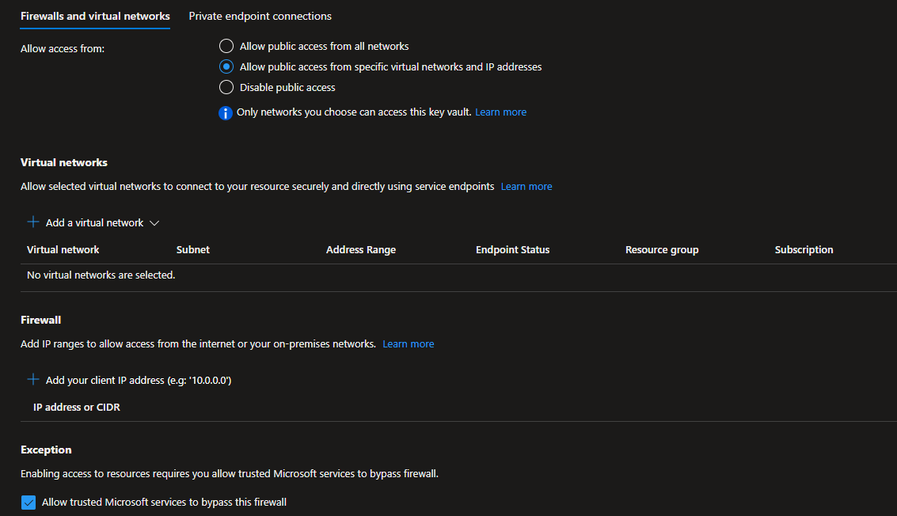

# ARM template to provide storage account with Customer Managed Keys and Private Endpoint

This arm template provisions a storage account with blob endpoint with encryption of data at rest using customer managed keys using Azure Key Vault. 
The arm template provisions both Storage Account, Azure Key Vault and places them behind a private endpoint in the designated virtual network. 

## Prerequisites

* Resource group created and user should have owner or contributor permissions on the Resource group.
* Virual network and subnet provisioned.
* User Assigned Managed Identity created.

## Steps

 

## Additional Config

The ARM template allows AzureServices access to the AKV in the Networking configuration. This can be changed to "Disabled public access" once the arm deployment is completed. 

